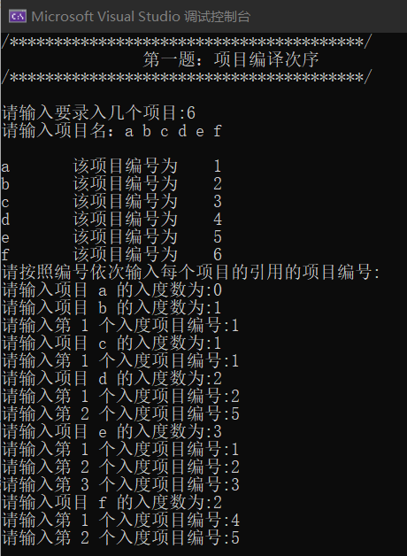
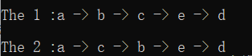
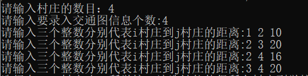
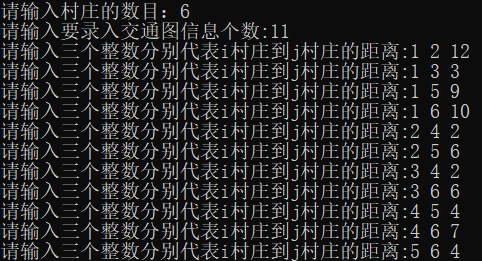
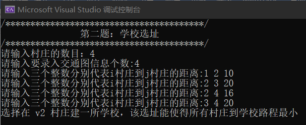
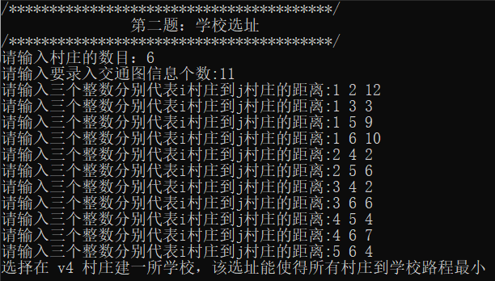
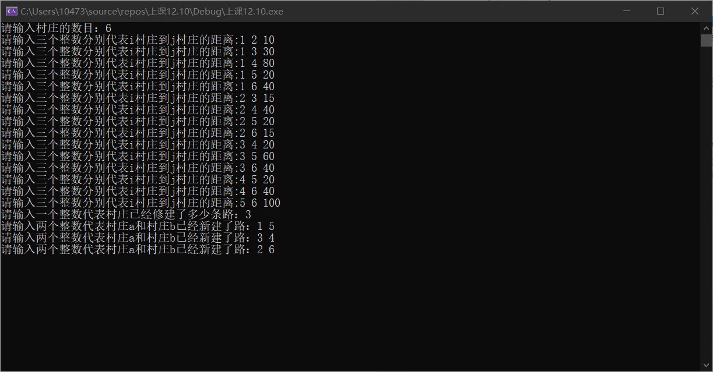
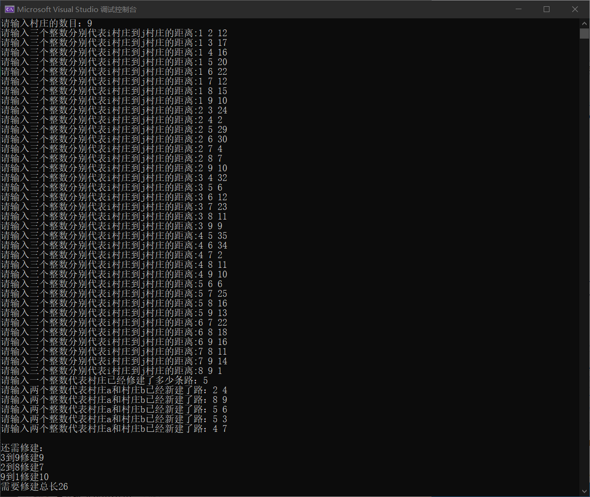
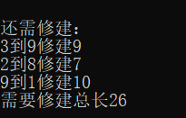
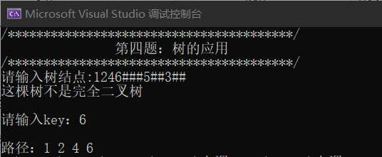

# 数据结构实验期末作业实验报告

**一、实验题目：1，项目编译次序**

**二、主要功能介绍**

1、功能描述

根据输入的工程名以及其之间的关系，输出各个项目的编译次序，至少两种不同的编译次序

2、主要算法及原理介绍：

利用拓扑排序不断遍历将入度为0的入队操作，且在后面进行出队遍历，最后输出次序。通过一个标记变量，找出两个不同次序。

**三，程序运行效果图**

 1）测试数据：（图等数据）

2）实验结果：（运行截图）

**一、实验题目：2，学校选址**

**二、主要功能介绍**

1、功能描述

给定n个村庄之间的交通图，从这n个村庄中选择一个村庄建一所学校，使得所有村庄到学校的路程差异最小

2、主要算法及原理介绍：

通过Dijkstra算法，遍历计算每个结点到其余结点距离，用结构体存每个结点以及对应的长度，用结构体排序得出最短的结点。 

**三，程序运行效果图**

 1）测试数据：（图等数据）

测试数据1：

测试数据2：

2）实验结果：（运行截图）

测试结果1：

测试结果2：

**一、实验题目：3，修建道路**

**二、主要功能介绍**

1、功能描述

N个村庄，从1到N编号，现在请您兴建一些路使得任何两个村庄彼此连通。我们称村庄A和B是连通的，当且仅当在A和B之间存在一条路，或者存在一个存在C，使得A和C之间有一条路，并且C和B是连通的。

已知在一些村庄之间已经有了一些路，你的工作是再兴建一些路，使得所有的村庄都是连通的，并且兴建的路的长度是最小的。

2、主要算法及原理介绍：

最短路径算法

原理：

1）     设置一个二维数组len存入每个村庄之间的距离，根据输入的已修建路线村庄，将其二维数组位置设置为0。

2）     设置一个lower数组存当前轮次最短距离数组，由于后续找最小值

3）     设置一个isvisited bool数组用于记录已经被记录的村庄

4）     通过lower与len两个数组之间的比较不断迭代计算找到最短路径依次存入shortans数组

5）     在计算最小值时用一个parent二维数组记录下当前轮次上一级的下标，用于记录是哪两个村庄之间的连线。

2、程序运行效果图

 1）测试数据：（图等数据）

测试数据1：

测试数据2：

2）实验结果：（运行截图）

测试1结果：

测试2结果：

**一、实验题目：4，树的应用**

**二、主要功能介绍**

1、功能描述

建立一颗二叉树，判断该数是否为完全二叉树，输入一个key，可以实现该结点从根节点开始的路径

2、主要算法及原理介绍：

   1）建立二叉树用链式存储结构存结点的左孩子与右孩子以及数据

   2）判断是否完美二叉树：利用层序遍历依次判断每一层的情况，若只有右孩子那么说明该树一定不是完美二叉树；若遍历到一个左孩子或遍历到一个叶子结点，下一次再是叶子结点或只有左孩子，那么该树也一定不是完美二叉树。

   3）利用先序遍历，利用回溯，如果树空返回false，若遍历到结点说明该路线正确返回true，将数据存入length数组中，最后统一逆序输入从结点到key的路线。

2、程序运行效果图

1）测试数据：（图等数据）

2）实验结果：（运行截图）

# Data-structure
